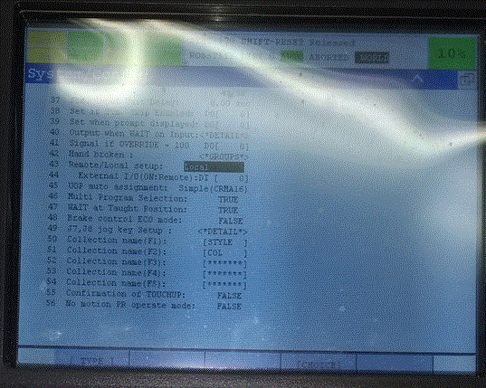
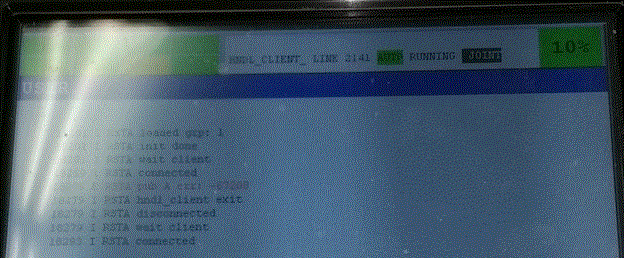

# Fanuc LRMate 200iD
 
----

# Robot Operation Instructions
 
----


## Quick Summary:
Fanuc LRMate 200iD
Company: Fanuc
Controller: R i30 
Version: V8.3.0 P/13 7DC3/13
DOF: 6
Joint names: joint_1, joint_2, joint_3, joint_4, joint_5, joint_6
Joint limits:
joint velocities:

## Put Fanuc into Local Mode:
This is a mandatory step to get ROS-I programs to work.Set to local mode using TP:

	[Menu] -> [0] Next [6] System 
	Variable Config 43: Remote/Local [F4 (Config)] Local [Enter]

## Powerup Auto Mode:
 1. Turn on power on front of controller (keyed)
 2. Turn switch to AUTO, make sure teach pendant upper left corner knob is OFF
 3. Start a ROS program, e.g. rostate

	 [Teach][Select] => scroll down to rostate hit [Enter]
(starts 2 programs)
 4. Cycle start 

	Green Auto button on front controller panel, press/release, green Light should go on.
## Powerdown:
 1. Kill ROS programs - DO TWICE - 2 programs running
[**FCN** ] -> 1 -> [**ENTE** ]
[**FCN** ] -> 1 -> [**ENTE** ]
## Teach Mode:
 1. TP upper left corner - ON
 2. Controller Key out of auto
 3. Reset Fault:
 1. Hold 1/2 way deadman switch on left side of TP
 2. [SHIFT] (Hold) Hit [RESET] button on TP
 3. red fault light on TP should go off
 4. Test working teach mode
 1. [SHIFT] +/- Z buttons should move robot
 5. To select program, e.g. ROS joint streaming in teach mode
 1. [TEACH] [SELECT] ROSSTATE [ENTER]
 2. Start program [SHIFT] [FWD] TP buttons
 3. Fanuc Controller Cycle Start button should be Green!
## Fault Recovery
If fanuc controller faulted, you have to manually reset the joint(s) to a "safe" position:
 1. Turn controller box to teach pendant from auto
 2. Pendant ON
 3. hold deadman switch half-on, [SHIFT] Hold, hit [Reset]
 4. Now move robot - +/- joint key or xyz key
 5. Note to increase traversal- feedoverride in green xx% field in upper right corner
## Run a Fanuc demo in ROS Industrial

	roslaunch fanuc_lrmate200id_moveit_config  moveit_planning_execution.launch 
	    sim:=false   robot_ip:=192.168.1.34
## Verifying Fanuc Driver (from Gijs)
Driver can be found at:
https://github.com/ros-industrial/packet-simplemessage 
Running Fanuc Robot with ROS-I Fanuc experimental:
 1. Install ROS on Linux box
 2. Make a workspace in ROS
 3. Clone ROS Industrial, Fanuc, Fanuc Experimental Repositories from ROS-I:

	https://github.com/ros-industrial
 4. Follow the "Running the ROS-Industrial programs on your Fanuc robot" on the ROS-I Fanuc tutorials web site:

	http://wiki.ros.org/fanuc/Tutorials
 1. Step 1: RoboGuide Simulation.
 We did not have RoboGuide so we skipped step 1
 2. Step 2: Testing Robot Teach mode with real robot. 
 On the TP, start the rosstate TPE program. (See Teach mode above). Set the Fanuc TP up in Teach Mode, and start the ROSSTATE (all caps) on the teach pendant.
On the Linux PC, run:

	roslaunch fanuc_X_support robot_state_visualize_M.launch robot_ip:=IP_OF_ROBOT
	bswap:=true
On the teach pendant you should see a "connect" diagnostic message.
Verify correspondence between RVIZ and real robot by jogging the robot around with the TP - YOU SHOULD SEE THE CORRESPONDING SIMULATED ROBOT MOVE IN RVIZ. When done, ABORT the rosstate program. ctrl+c the ROS session.
 3. Step 3: mode control of the Fanuc robot using RVIZ to move real Fanuc robot around.
At first, we could't get the ROS programs to work, as each time we attempted to turn the Cycle Start button it failed to give us the following error.
FAILED ILLEGAL PARAMTER From: http://wiki.ros.org/fanuc_driver/Troubleshooting 
### FILE-032: Illegal parameter
The TP shows the following on the User Menu:

	12345 E PROG cfg error: -1
	12346 E PROG check cfg
Where PROG is any of RSTA or RREL.
**Cause:** the configuration of the respective program is either uninitialised, or has not been completed.
**Remedy:** make sure the configuration of all ROS-Industrial programs has been completed, and that the checked entry is set to TRUE. Refer to the KAREL Programs section of the installation tutorial for information on the setup of the KAREL and TPE programs.
We thought we had already done the configuration step outline in the ROS-I Fanuc tutorials. So we attempted to double check the parameters of the ROS programs. 
Note 1: The TPE program movesm we couldn't appeart to change varaibles.
Note 2: We did change the ros_traj (or ros_movesm) program to checked from FALSE to TRUE.
[**TEAC** ] [**SELEC** ] [F1=TYPE] Karel Prog [DATA] [F1=Type] Karel Vars]
<TABLE>
<TR>
<TD>checked </TD>
<TD>boolean </TD>
<TD>TRUE </TD>
<TD>- </TD>
<TD>Configuration has been completed by user </TD>
</TR>
</TABLE>
Then the Fanuc controller Cycle Start worked. We were able to get RVIZ simulation to kinda work:
roslaunch fanuc_M_moveit_config moveit_planning_execution.launch sim:=false robot_ip:=IP_OF_ROBOT 
Response was sluggish, Delay was displayed repeatedly on the TP.

## BSWAP ISSUE
The communication between the Fanuc and the ROS-I using Simple Message communication protocol uses raw data that is byte order dependent. If the bytes are misaligned a communication error can result:
You must match the "Endianness" of the ROS platform with the Fanuc platform.
The Intel platform is Little Endian while the Fanuc Controller platform is Big Endian (ARM or RISC maybe?)
You need byte swapping when the Endianness of the platforms does not match.


NOTES
1)  There is a difference in the  world coordinates betweeen the simulated rviz fanuc robot and the real Fanuc robot.  The difference is due to the pedastal being at (0,0,0) in the simulation and on the real robot, (0,0,0) is at the base of the robot on top of the pedestal.
To verify this:

	roslaunch fanuc_200id_moveit_config moveit_planning_execution.launch sim:=false robot_ip:=192.168.1.33
then open Robot Scene and open tool link to get the end-effector Cartesian position. It will be off from the real robot position as shown on the TP:
[MENU] [COOR] [COOR]  until in world coordinates
Then push [POSN] button at bottom left of TP.

Autogenerated by [Word2Markdown](https://github.com/johnmichaloski/SoftwareGadgets/tree/master/Word2Markdown)